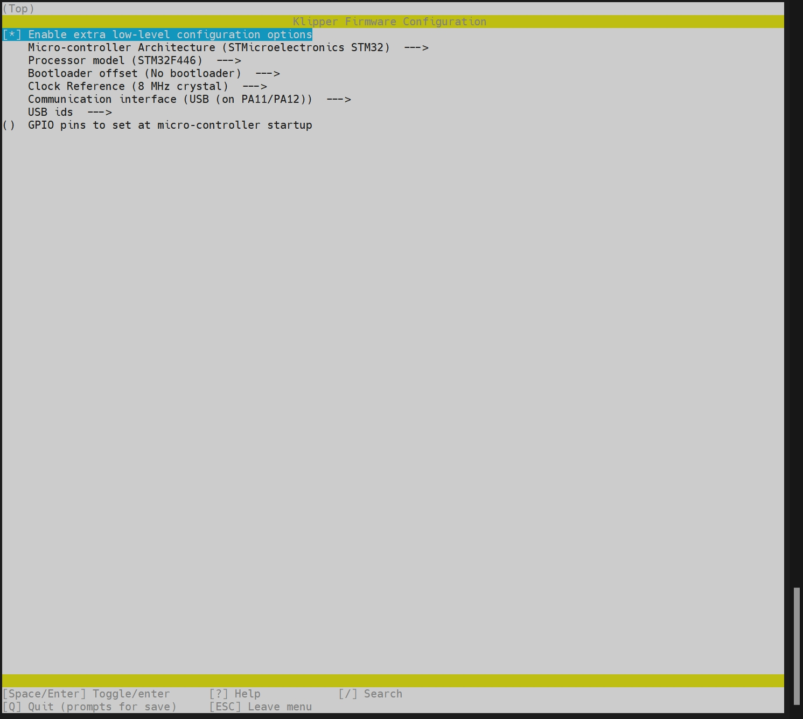
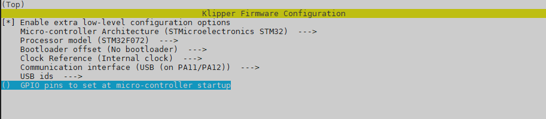

# Flashing new Klipper version
Login to CM68 using SSH.

```bash
lsbusb      # Show USB IDs for the MCUs
./kiuah/kiauh.sh  (Don't upgrade to alpha version)
```
In KIAUH select:
```
2) [Update]
1) [Klipper]
B) « Back
4) [Advanced]
4) [Build + Flash]
```
* Select correct settings for MCU in "make menuconfig"!
* See up-to-date settings in Github/wiki, but typically something like this:
* * Fysetc Catalyst v2.1: **STM32F446**
* * M36 tool head: **STM32F072**
* * [Catalyst](https://github.com/FYSETC/Catalyst_Kit_V2.0?tab=readme-ov-file)
* * [M36_HUB](https://github.com/FYSETC/M36_HUB_V1/tree/main?tab=readme-ov-file)
* * [Fysetc wiki](https://wiki.fysetc.com/docs/M36HUBV1).
* Select **Q** to quit and save config for a MCU.
```
1) Regular flashing method
1) make flash (default)
1) USB
Select CORRECT MCU!
Continue to flash
```

Repeat for the other MCU.

## Examples from Fysetc's Github on 5/9-2025:
### Catalyst


### M36
